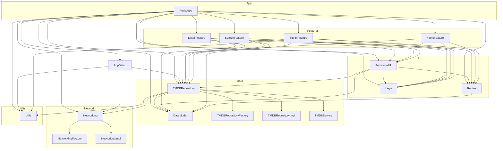

# 🎥 Periscope

Periscope is a simple movie search app built in SwiftUI. This project is a personal learning playground to explore:

- Swift Concurrency (`async/await`, structured concurrency)
- Modular architecture with Swift Package Manager
- SwiftUI-based UI patterns and design systems

> ⚠️ **Note:** This project is not production ready.

https://github.com/user-attachments/assets/4f398da3-6368-4fc4-b2a0-aeffa1c1850a

---

## 🚀 Installation Instructions

1. **Clone the Repository**

   ```bash
   git clone git@github.com:RoshanNindrai/Periscope.git
   cd Periscope
   ```

2. **Open in Xcode**

   ```bash
   open Periscope.xcodeproj
   ```

3. **Set Up API Key**

   Create a new file named `Secrets.swift` in the project and add the following:

   ```swift
   enum Secrets {
       static let TMDB_API_KEY = "<Your_TMDB_API_Key_Here>"
   }
   ```

   > ⚠️ **Important:** Do not commit this file. Add `Secrets.swift` to your `.gitignore`.

4. **Build and Run**

   Select the `Periscope` target and run it on a simulator or device.

---

## 🎬 Get Your TMDB API Key

1. **Create a TMDB Account**  
   Sign up at [themoviedb.org](https://www.themoviedb.org) and verify your email.

2. **Request an API Key**  
   - Go to your profile → **Settings** → **API**  
   - Choose **Developer**, agree to terms, fill in app details  
   - Submit your request

3. **Copy the Key**  
   Once approved, your key will appear in the API section.

> 📖 See the full guide: [TMDB Getting Started Docs](https://developer.themoviedb.org/docs/getting-started)

---

## 🧱 Project Structure & Modules

### Module Graph



---

## 📦 Key Modules

### `DataModel`
Contains all data models for movies, people, genres, collections, and related entities.  
Provides the core domain model types used throughout the app.

### `HomeFeature`
Handles the home screen feature logic and parallel data fetching of trending, popular, upcoming, and top-rated categories.

### `PeriscopeUI`
Hosts reusable SwiftUI views and UI components for media displays.  
Includes environment-based theming and image URL logic.

### `Lego`
A minimal SwiftUI-based design system.  
Includes typography, spacing, colors, and layout primitives.

### `SignInFeature`
Manages the sign-in flow and localization for multi-language support.

### `TMDBRepository`
The main data access layer for TMDB APIs.  
Uses async/await with dependency injection via factories and protocol abstraction.

### `Networking`
Composes and abstracts HTTP networking layer to power repository and service calls.

### `AppSetup`
Centralized app bootstrapping and dependency configuration module.

---

## 🧠 Learning Focus

- **SwiftUI**: Learn modern declarative UI building blocks.
- **Swift Concurrency**: Use structured concurrency and async/await for clean async code.
- **Modular Architecture**: Explore a scalable modular project layout.

---

## 📄 License

This project is licensed for educational use only. See [LICENSE](LICENSE) for details.
