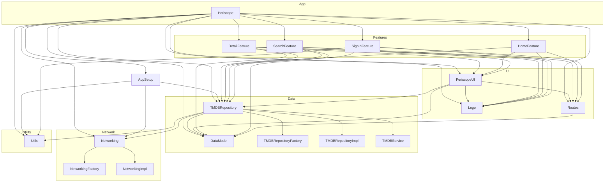

# Periscope

Periscope is a simple Movie bookmark app built in Swift. This project is designed as a learning resource for SwiftUI and the new Swift Concurrency APIs (async/await, structured concurrency, etc). THIS IS NOT PRODUCTION READY IN ANY MANNER

https://github.com/user-attachments/assets/4f398da3-6368-4fc4-b2a0-aeffa1c1850a

---

## Project Structure & Modules

### Module Structure

```mermaid
graph TD

%% App Root
subgraph App
    Periscope
end

%% Features
subgraph Features
    SignInFeature
    DetailFeature
    HomeFeature
    SearchFeature
end

%% UI Layer
subgraph UI
    PeriscopeUI
    Routes
    Lego
end

%% Data Layer
subgraph Data
    DataModel
    TMDBRepository
    TMDBRepositoryFactory
    TMDBRepositoryImpl
    TMDBService
end

%% Networking Layer
subgraph Network
    Networking
    NetworkingFactory
    NetworkingImpl
end

%% Utilities
subgraph Utility
    Utils
end

%% App Dependencies
Periscope --> SignInFeature
Periscope --> DetailFeature
Periscope --> HomeFeature
Periscope --> SearchFeature
Periscope --> PeriscopeUI
Periscope --> TMDBRepository
Periscope --> Networking
Periscope --> Utils
Periscope --> AppSetup
Periscope --> DataModel
Periscope --> Routes
Periscope --> Lego

%% AppSetup Dependencies
AppSetup --> TMDBRepository
AppSetup --> Networking
AppSetup --> Utils

%% TMDBRepository Dependencies
TMDBRepository --> TMDBRepositoryFactory
TMDBRepository --> TMDBRepositoryImpl
TMDBRepository --> TMDBService
TMDBRepository --> DataModel
TMDBRepository --> Networking
TMDBRepository --> Utils

%% Networking Composition
Networking --> NetworkingImpl
Networking --> NetworkingFactory

%% PeriscopeUI Dependencies
PeriscopeUI --> DataModel
PeriscopeUI --> Lego
PeriscopeUI --> Routes
PeriscopeUI --> TMDBRepository

%% DetailFeature Dependencies
DetailFeature --> DataModel
DetailFeature --> Lego
DetailFeature --> PeriscopeUI
DetailFeature --> Routes
DetailFeature --> TMDBRepository

%% HomeFeature Dependencies
HomeFeature --> Lego
HomeFeature --> PeriscopeUI
HomeFeature --> Routes
HomeFeature --> TMDBRepository

%% SearchFeature Dependencies
SearchFeature --> DataModel
SearchFeature --> Lego
SearchFeature --> PeriscopeUI
SearchFeature --> TMDBRepository

%% SignInFeature Dependencies
SignInFeature --> Lego
SignInFeature --> Routes
SignInFeature --> TMDBRepository
SignInFeature --> Utils

%% Routes Dependency
Routes --> DataModel
```

---

### DataModel
- **Purpose:**  
  Contains all data models for movies, people, genres, collections, and related entities.  
  Provides the core Domain model types used throughout the app for representing and passing media data.

---

### HomeFeature
- **Purpose:**  
  Manages the main home screen feature of the app.  
  Handles fetching of trending, popular, upcoming, and top-rated media categories using Swift concurrency for efficient parallel data loading.

---

### PeriscopeUI
- **Purpose:**  
  Hosts reusable SwiftUI views and UI components for displaying media items, images, and related visual elements.  
  Leverages environment objects for style and image URL construction.

---

### Lego
- **Purpose:**  
  A Simple attempt on a SwiftUI based Design System  
  Provides reusable building blocks, including theming and asset management, to ensure consistent UI across the app.

---

### AppSetup
- **Purpose:**  
  Responsible for dependency injection and application-wide setup.  
  Centralizes configuration of core services such as networking and authentication, ensuring modular and testable architecture.

---

### SignInFeature
- **Purpose:**  
  Handles the sign-in flow for the app.  
  Includes localization resources to support multiple languages and enhance accessibility.

---

### Supporting Files
- **Configuration and Assets:**  
  Includes app configuration files, URL scheme definitions, and image assets necessary for app branding and integration with external services.

---

## Learning Focus

- **SwiftUI:**  
  The project is structured around SwiftUI for modern, declarative user interface development.
- **Swift Concurrency:**  
  Makes extensive use of async/await and structured concurrency to handle asynchronous tasks in a safe and readable way.
- **Modular Design:**  
  Codebase is organized into clear, feature-oriented modules to reflect best practices in Swift app architecture.
- **Localization:**  
  The app is prepared for multi-language support, with localizations for user-facing text.

---
